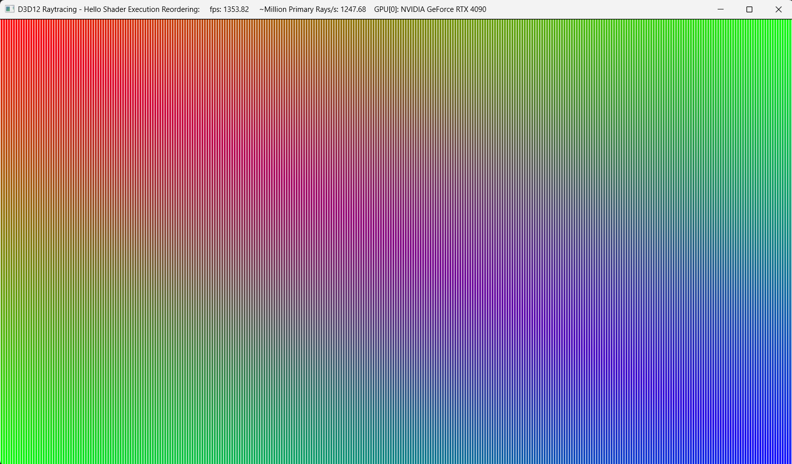

# D3D12 Raytracing Hello World sample

This sample is a minor tweak of the D3D12RaytracingHelloWorld sample demonstrating Shader Execution Reordering. This is accomplished in a simple way by raytracing a full screen quad with some portion of rays doing an artificial work loop.  The rays doing artificial work render white.  Shader Execution reordering is used to attempt to reorder threads based on the workload.  There are a bunch of #defines that can be tweaked in Raytracing.hlsl to experiment with different behaviors. The sample compiles on the fly, so shader tweaks can be done between runs of the app without recompiling the app.

## Usage
D3D12RaytracingHelloShaderExecutionReordering.exe 

Additional arguments:
  * [-forceAdapter \<ID>] - create a D3D12 device on an adapter \<ID>. Defaults to adapter 0.

### UI
The title bar of the sample provides runtime information:
* Name of the sample
* Frames per second
* Million Primary Rays/s: a number of dispatched rays per second calculated based of FPS.
* GPU[ID]: name

## Requirements
* Windows 10 with the October 2019 update or higher.
* Consult the main [D3D12 Raytracing readme](../../readme.md) for further requirements.